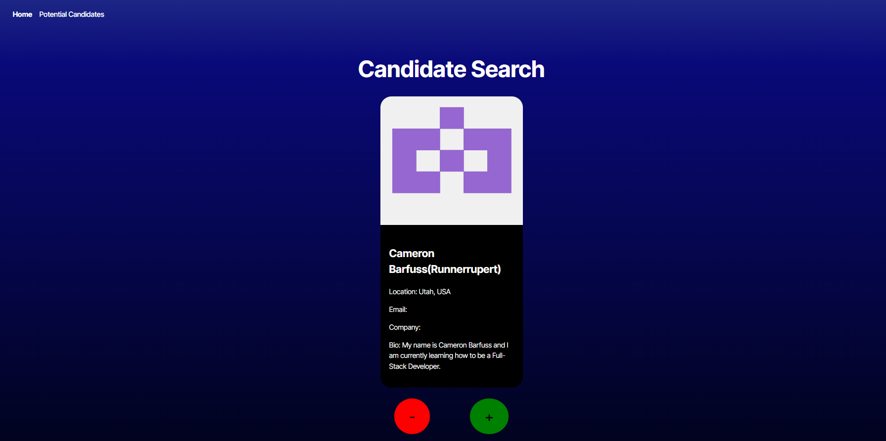
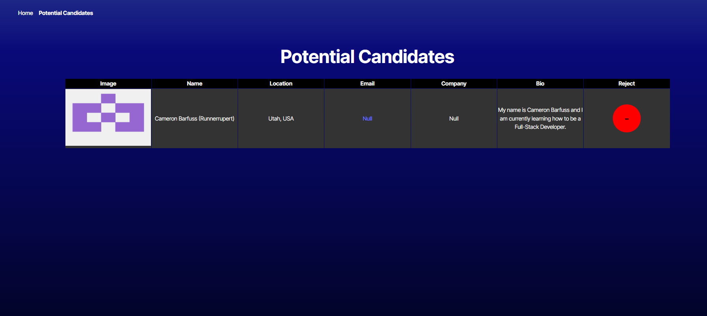

# Candidate-Search

### Table of Contents
- [Description](#description)
- [How to Install](#how-to-install)
- [Usage](#usage)
- [License](#license)
- [Contributors](#contributors)
- [Questions](#questions)

---

---

## Description

This website was created to allow for better UI/UX for viewing different potential candidates information. 

---

## How to Install

This project does not require installation, just go to the website: https://candidate-search-0c3h.onrender.com 

---

## Usage

This website is used to see information about different Github users. On the "Home" page, you can add the data given for a Candidate using the + button, or move on to another Candidate using the - button. Given that this data is pulled using the github API, there are a lot of users that do not have much information. When a user is added using the green + button, they are stored within the "Potential Candidates" page.

Within the Potential Candidates page, a table is provided with all the information for each candidate you have chosen to add. You can remove a candidate by pressing on the - button next to that specific candidates information. 

---

## License

For more information about the MIT license, use this link!
 https://memgraph.com/blog/what-is-mit-license

---

## Contributors

University Of Utah Coding Bootcamp and Cameron Barfuss

Specifically, The coding bootcamp has taught different code elements to use to be able to create a functioning website, I wrote some of the code with references to code used in instruction.

---

## Questions

My Github: https://github.com/Runnerrupert

My Email Address: Cameron.barfuss@gmail.com

You can contact me using my Github link or via Email if you have any questions about Candidate-Search.

--- 

## Other Images

